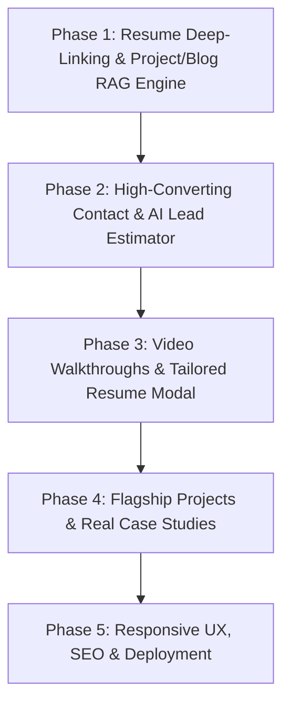

# Comprehensive Portfolio Audit & End-to-End Production Roadmap

**Target Persona**: Startup Founders, Product-Focused Engineering Leads, High-Ticket Freelance Clients  
**Core Positioning**: Full-Stack Developer + AI Systems Integrator (Building Production MVPs & Intelligent Apps)

---

## Executive Overview & Strategic Positioning

Your portfolio possesses a rare competitive advantage: **it demonstrates AI capabilities natively through user interaction**, rather than just listing "AI/ML" as a keyword on a static resume page.

Key architectural strengths currently in place:
1. **Intent-Driven Component Routing**: Visitors can prompt the site naturally (*"Show me your projects"*) to trigger UI navigation via OpenAI `gpt-4o-mini`.
2. **Contextual AI Selection Assistant**: Visitors can highlight any text/tech term to get instant 1-2 sentence explanations or ask custom questions.
3. **Glassmorphic Design System**: Dark/light mode theme toggling, sleek motion effects, and clean responsive containers.

To convert visitors into high-ticket clients or startup job offers, the next phase focuses on **Resume Deep-Linking**, **Project/Blog RAG Q&A**, **Automated Lead Generation**, **Authentic Video Proof**, and **Founder Conversion Rate Optimization**.

---

## Detailed Section-by-Section Audit & Strategic Additions

### 1. Resume Deep-Linking & Project RAG Knowledge Engine (`/#projects/[id]` & `app/api/ai/route.ts`)
- **Resume Deep-Link Routing**:
  - Allow links on your resume (e.g. `sanket-portfolio.com/#projects/mern-job-portal` or `sanket-portfolio.com/#blogs/nextjs15-ai-architecture`) to open the portfolio directly to that specific project's Case Study modal or blog article on page load.
- **Context-Aware Project & Blog RAG Q&A**:
  - Upgrade `/api/ai/route.ts` to perform Retrieval-Augmented Generation (RAG) over full project specs in `content/projects.ts` and `content/blogs.ts`.
  - When a recruiter asks *"How did Sanket handle database scaling in the job portal?"*, OpenAI receives full project architecture details (problem, schema, challenges overcome, metrics, tech stack) and delivers a deep, precise technical answer.
- **In-Modal "Ask AI About This Project" Button**:
  - Add a quick prompt button inside Case Study modals and blog readers: `✨ Ask AI About This Project`.

### 2. Interactive Lead Generation & AI Scope Estimator (`components/sections/Contact.tsx` & `app/api/contact/route.ts`)
- **AI Scope & Cost Estimator (Lead Magnet)**: An interactive tool where founders select project type (*SaaS MVP*, *Full-Stack App*, *AI Integration*), target timeline (*10-Day Sprint*, *1 Month*), and 1-sentence product description.
- **Lead Capture Form**: Collects high-intent lead details (Name, Company Name, Contact Email, Phone/WhatsApp number, Budget Range).
- **Instant Proposal Preview & Direct Email Dispatch**: Generates an on-screen architecture scope preview and dispatches full project inquiry to your inbox via Resend/Nodemailer.

### 3. Video Studio Integration & Video Demos
- **Personal Video Pitch in Hero**: A short 60-second video of Sanket introducing his 10-day MVP delivery model and inviting clients to test the live AI assistant.
- **Embedded Loom Video Walkthroughs in Case Studies**: Embed 90-second video product demos inside each project's Case Study modal in `ProjectCard.tsx`.

### 4. Dynamic Resume & Tailored CV Viewer (`components/ui/ResumeModal.tsx`)
- **Navbar & Hero CTA**: Add a prominent `📄 View Resume` button.
- **Interactive Resume Modal**: Allows hiring managers to view your career achievements, full-stack proficiencies, and verified client deliverables.
- **Tailored PDF Downloads**: Offer direct download links for:
  - 📄 *Full-Stack Software Engineer Resume*
  - 🤖 *AI Systems Architect Resume*

### 5. "How I Work with Founders" (Process & Guarantee Section)
- **3-Step Delivery Model**:
  1. *48-Hour Discovery & Architecture Prototype*
  2. *10-Day Full-Stack MVP Sprints*
  3. *Production AI Integration & Deployment*
- **Founder Guarantees**: *100% Code Ownership*, *Daily Async Slack/Loom Updates*, *Post-Launch Support*.

### 6. Projects & Flagship Case Studies (`content/projects.ts` & `ProjectCard.tsx`)
- **Real Flagship Projects**: Replace sample data with your top 3–4 actual full-stack + AI projects.
- **Authentic Metrics & Architecture**: Ensure each case study has real numbers (*"Saved 20+ hours/week for hiring managers"*, *"Processed 50,000+ student queries"*).

### 7. Technical Blogs & Case Studies (`content/blogs.ts` & `Blogs.tsx`)
- **Production Articles**: Write 3 in-depth technical blogs showcasing real engineering decisions (e.g., *"How I Built a Latency-First AI Prompt Router in Next.js 15"*, *"Optimizing PostgreSQL Indexes for High-Traffic MVPs"*).

---

## Technical & Cross-Device Polish

1. **Mobile Responsiveness**:
   - Verify fixed floating chat bar and quick menu buttons do not overlap on small screens (<375px) or block mobile keyboard inputs (`viewport-fit=cover`).
   - Touch targets for all prompt chips and navigation buttons must be at least 44×44px.

2. **SEO & Social Sharing**:
   - Add standard metadata in `app/layout.tsx`: `title`, `description`, `keywords`, `openGraph` image card, and `twitter:card`.
   - Add JSON-LD Structured Data (`Person` schema for developer portfolio).

3. **Production Hardening**:
   - Add API rate limiting on `/api/ai` and `/api/summary` to prevent API key quota exhaustion.
   - Implement graceful fallback state when `OPENAI_API_KEY` is missing or returns rate limit errors.

---

## Strategic Implementation Phases

